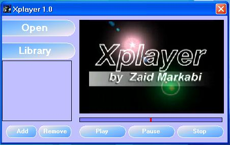



## Video\\Music Xplayer 1\.0

### Description

Xplayer 1.0

Simple Video\Music player, support most popular formats, with Library menu,

watch your favorite videos by using this simple project..

Note : this application deppends on WindowsMediaPlayer OCX .
 
### More Info
 

             |
---                |---
**Submitted On**   |2009-04-16 20:27:02
**By**             |[Zaid Markabi](https://github.com/Planet-Source-Code/PSCIndex/blob/master/ByAuthor/zaid-markabi.md)
**Level**          |Beginner
**User Rating**    |4.3 (26 globes from 6 users)
**Compatibility**  |VB 5\.0, VB 6\.0
**Category**       |[Complete Applications](https://github.com/Planet-Source-Code/PSCIndex/blob/master/ByCategory/complete-applications__1-27.md)
**World**          |[Visual Basic](https://github.com/Planet-Source-Code/PSCIndex/blob/master/ByWorld/visual-basic.md)
**Archive File**   |[Video\_Musi215410632009\.zip](https://github.com/Planet-Source-Code/zaid-markabi-video-music-xplayer-1-0__1-72151/archive/master.zip)

